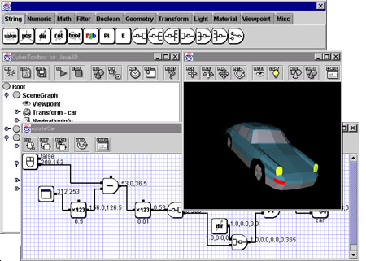
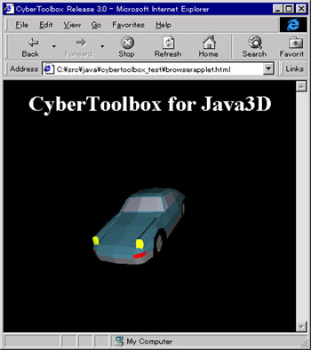

# CyberToolbox For Java3D

CyberToolbox for Java3D is an authoring tool of Virtual Reality on Java2 and Java3D platforms. The CyberToolbox is based on a scene graph of VRML97, however has a visual programming language with an original event model that is different from VRML97 to create more good behaviors easily.

Note : CyberToolbox for Java3D is a different product from CyberToolbox for Java that is based on a scene graph and an event model of VRML97.

The CyberToolbox is released with an applet program to browse contents that are created using the CyberToolbox. Using the applet, everyone can browse the contents with Microsoft Internet Explore or Netscape Communicator on the Internet.

I am developing the CyberToolbox with CyberVRML97ForJava for Java that is a development package for VRML97 and Java3D. If you have any interest in application developments of VRML and Java3D, see this page.

## Repository

- [CyberToolbox for Java3D User's Guide v1.2
(English)](doc/ctbj3d120usersguide.pdf)
-  [CyberToolbox for Java3D User's Guide v1.2 (Japanese)](doc/ctbj3d120usersguide.pdf)
